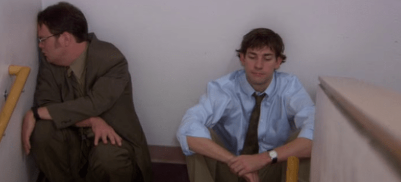

# The Body Keeps the Score

  

>It’s a book about healing But honestly, it’s about living, too. It digs into what happens when the mind and body drift apart, when everything starts to feel numb or disconnected. It’s one of those books I keep coming back to, just to remind myself the importance of staying connected. 

>- The biggest source of our suffering is the lies we tell ourselves. And it is usually about **love** and **loss**
>
>- Trauma almost always invariably involves not being seen, not being mirrored, and not being taken into account.  

## Summary 
(drafting)

## Index
- [Chapter 4 Anatomy](c4-anatomy.md) - What happen when you brain see threats?
- [c15-EDMR](c15-EDMR.md)
- [c16-yoga](c16-yoga.md)
- [c17-IFS](c17-IFS.md)
- [c18-Creating-Structures](c18-Creating-Structures.md)
- [c19-applied-neuroscience](c19-applied-neuroscience.md)
- [c20-finding-your-own-voice](c20-finding-your-own-voice.md)

