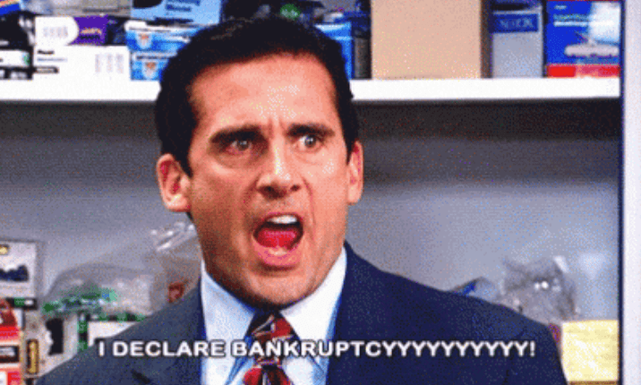

  

# Things we need to Know about WEALTH

- Fast wealth is created asymmetrically, not linearly. 
- Get rich quick != get rich easy 
- The slow lane might still get you rich, but slow... perhaps when you are in your 60s and not in your best mobility (not being able to enjoy it). 
- Trade time for the money is a trap (it might work, but not the fast lane)
- Money does grow on tree. But you need to BUILD THE MONEY TREE. see [Does Money Grow on Trees?](c19-money-grows-on-tree.md)
- How to get RICH??? Seriously! [Chapter 18 The Rich Equation](c18-how-rich-get-rich.md)
- [The Law of Wealth](c21-law-of-wealth.md) - The Law of Effection

## My notes
- Find the why
- Find the THINGS (service/ products) people need
- Be in the control (in the sense of being able to control the scale and magnitude)
- `Net Profit = Unit Sold(Scale) x Unit Profit (Magnitude)`