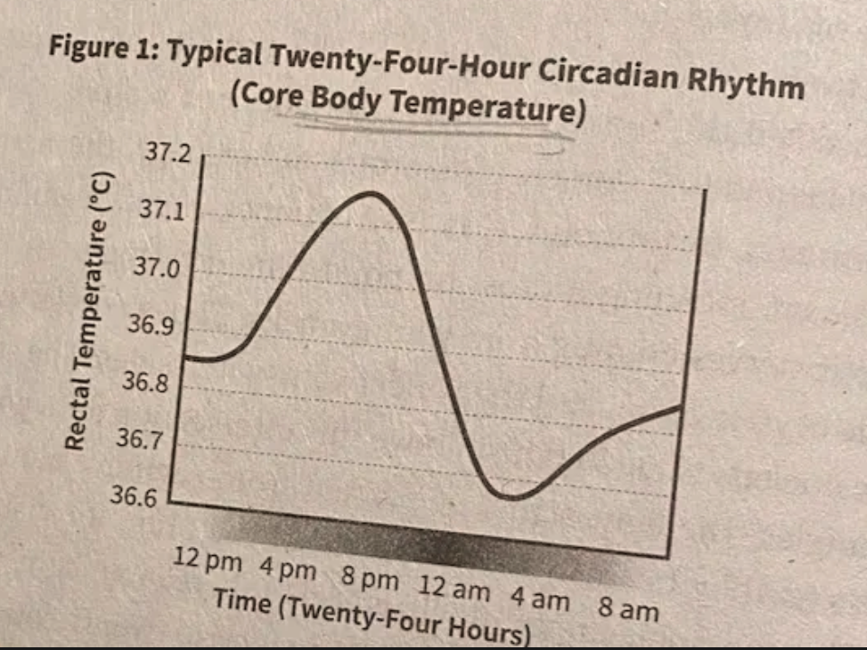
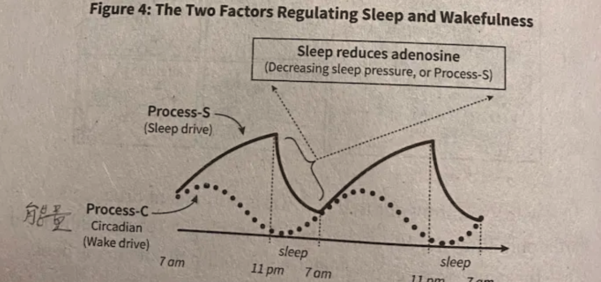
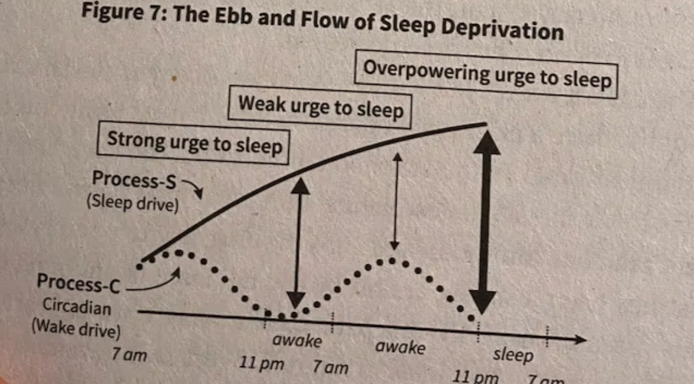

# What Makes You Sleepy? 
1. Circadian Cycle 
2. Sleep Pressure

## Overview
- The first factor is a signal beamed out from your internal twenty-four-hour clock located deep within your brain. The clock creates a cycling, day-night rhythm that makes you feel tired or alert at regular times of night and day, respectively. 
- The second factor is a chemical substance that builds up in your brain and creates a "sleep pressure. The longer you've been awake, the more that chemical sleep pressure accumulates, and conse-quentially, the sleepier you feel.

## 1. Circadian Cycle

### 1.1 Short Experiement - The Mammoth Cave Experiement

Two researchers once decided it’d be fun (for science!) to live in total darkness inside Mammoth Cave. No sunlight, no phone glow, not even a sliver of light. Their question? _Would our internal clocks go haywire without daylight?_

You’d think their sleep schedules would implode—wake up at 3 a.m., nap at noon, full chaos. But nope! Even in pitch-black nothingness, their bodies kept ticking like well-behaved biological alarm clocks. Instead of random bursts of sleep, they followed a steady, repeating rhythm—like their brains said, “No light? No problem. We got this.”

Yet daylight isn't the only signal that the brain can latch on to for the purpose of biological clock resetting, though it is the principal and preferential signal, when present. So long as they are reliably repeating, the brain can also use other external cues, such as food, exercise, temperature fluctuations, and even regularly timed social interaction.

Thankfully, most of us don't live in Mammoth Cave, or the constant darkness it imposes. We routinely experience light from the sun that comes to the rescue of our imprecise, overrunning internal circadian clock. Sunlight acts like a manipulating finger and thumb on the side-dial of an imprecise wristwatch.

### 1.2 temperature

Your biological circadian rhythm coordinates a drop in core body temperature as you near typical bedtime. Although the temperature drop helps to initiate sleep, the temperature change itself will rise and fall across the twenty-four-hour period regardless of whether you are awake or asleep.

  

### 1.3 Melotonin -  Hey! It’s dark

Your suprachiasmatic nucleus communicates its repeating signal of night and day to your brain and body using a circulating messenger called melatonin.

Melatonin simply provides the official instruction to commence the event of sleep, but does not participate in the sleep race itself.

### 1.4 The Thing about jet lag

For every day you are in a different time zone, your suprachiasmatic nucleus can only readjust by about one hour. You may have noticed that it feels harder to acclimate to a new time zone when traveling eastward than when flying westward.

#### Why everybody has different circadian cycle?

So the group as a whole is not collectively vulernable!

Mother Nature would never pass on a biological trait-here, the useful variability in when individuals within a collective tribe go to sleep and wake up-that could enhance the survival safety and thus fitness of a species by this amount. And so she hasn't.

## 2. Sleep Pressure

Your twenty-four-hour circadian rhythm is the first of the two factors determining wake and sleep. The second is sleep pressure. At this very moment, a chemical called adenosine is building up in your brain and create the pressure to sleep (and can only be removed by sleeping).

### coffeine

It's the equivalent of sticking your fingers in your ears to shut out a sound. By hijacking and occupying these receptors, caffeine blocks the sleepiness signal normally communicated to the brain by adenosine.

Caffeine has an average half-life of five to seven hours.

Caffeine is removed from your system by an enzyme within your liver,*

### circadian cycle & sleep pressure

They are two distinct and separate systems that are ignorant of each other: They are not coupled; though, they are usually aligned.

  

The 24 hour circadian rhythm and the sleepiness signal of adenosine-are independent, and can be decoupled from their normal lockstep. People feel the strongest urge to sleep when the two’s vertical distance is at max.

  

### sleep debt and chronic disease

The debt will roll over into the next payment cycle, and the next, and the next, producing a condition of prolonged, chronic sleep deprivation from one day to another. This outstanding sleep obligation results in a feeling of chronic fatigue, manifesting in many forms of mental and physical ailments that are now rife throughout industrialized nations.

### did you have enought sleep? ask theese questions

- First, after waking up in the morning, could you fall back asleep at ten or eleven a.m.? If the answer "yes" you are likely not getting sufficient sleep quantity and/or qual-ity.
- Second, can you function optimally without caffeine before noon? I the answer is "no, then you are most likely self-medicating your state of chronic sleep deprivation.
- Other questions that can draw out signs of insufficient sleep are: If you didn't set an alarm clock, would you sleep past that time? (If so, you need more sleep than you are giving yourself.
- Do you find yourself at your computer screen reading and then rereading and perhaps rereading again) the same sentence? (This is often a'sign of a fatigued, under-slept brain.)
- Do you sometimes forget what color the last few traffic lights were while driving? (Simple distraction is often the cause, but a lack of sleep is another culprit.)
